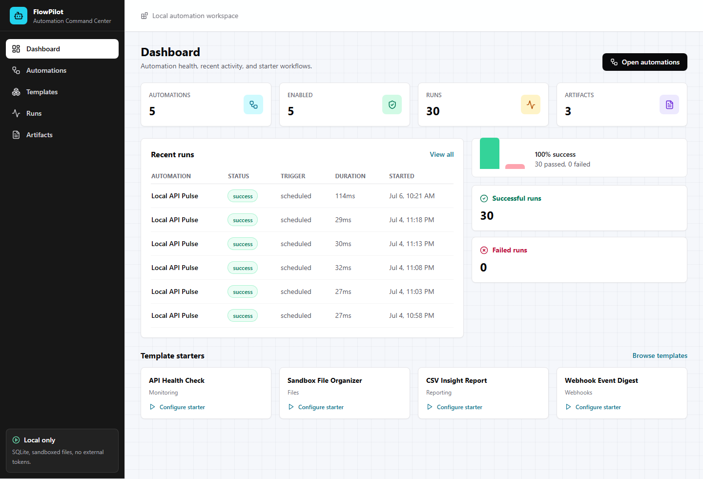

# FlowPilot

FlowPilot is a local automation command center for safe, inspectable workflows. It ships with a React dashboard, Fastify API, SQLite persistence, shared TypeScript schemas, and sandboxed automation templates that run without external accounts.



## Why It Exists

Automation projects often hide the hard parts: validation, logs, retries, execution history, artifacts, and safety boundaries. FlowPilot puts those pieces in one local product so each workflow can be created, run, audited, and improved.

## Features

- Dashboard with automation health, recent runs, success rate, and artifacts.
- Template-based workflows with shared Zod validation.
- Guided automation builder with template-specific config fields and backend validation.
- Manual, scheduled, and webhook triggers.
- Run logs, retry handling, persisted outputs, and Markdown artifacts.
- SQLite database via Prisma.
- Sandbox-first file automation: no writes outside `data/sandbox`.
- No auth provider, cloud account, Slack token, or GitHub token required.

## Automation Templates

| Template | Trigger | Output |
|---|---|---|
| API Health Check | Scheduled or manual | URL status, latency, and pass/fail logs |
| Sandbox File Organizer | Manual | Dry-run or sandbox-only file organization plan |
| CSV Insight Report | Manual | Markdown data profile artifact |
| Webhook Event Digest | Webhook | Markdown summary of inbound JSON payloads |

## Tech Stack

- React, Vite, Tailwind CSS, TanStack Query, lucide-react
- Fastify, Prisma, SQLite, Zod
- pnpm workspaces with `apps/web`, `apps/api`, and `packages/shared`
- Vitest for API and frontend smoke tests

## Quickstart

```bash
pnpm install
pnpm db:migrate
pnpm seed
pnpm dev
```

Open [http://localhost:5173](http://localhost:5173).

The API runs on [http://localhost:4357](http://localhost:4357).

## Useful Commands

```bash
pnpm dev              # API + web dev servers
pnpm build            # shared package, API, and web build
pnpm test             # API and frontend tests
pnpm lint             # TypeScript checks
pnpm db:migrate       # create/update SQLite schema
pnpm seed             # reset demo automations and sample sandbox data
pnpm capture:screenshots
```

## Demo Flow

1. Run `pnpm seed`.
2. Open the dashboard.
3. Go to Automations.
4. Click `New automation` and configure a workflow from a template.
5. Run `Customer CSV Insight`.
6. Open Artifacts and review the generated Markdown report.
7. Send a webhook:

```bash
curl -X POST http://localhost:4357/api/webhooks/lead-intake \
  -H "content-type: application/json" \
  -d "{\"email\":\"demo@example.com\",\"source\":\"github-readme\"}"
```

## Safety Model

FlowPilot v1 intentionally avoids arbitrary code execution. File automation uses a sandbox path resolver that rejects absolute paths and traversal outside `data/sandbox`. The organizer defaults to dry-run mode, and every automation stores logs and artifacts for review.

## API Surface

- `GET /api/health`
- `GET /api/dashboard`
- `GET /api/templates`
- `GET/POST /api/automations`
- `GET/PATCH/DELETE /api/automations/:id`
- `POST /api/automations/:id/run`
- `PATCH /api/automations/:id/toggle`
- `GET /api/runs`
- `GET /api/runs/:id`
- `GET /api/artifacts`
- `POST /api/webhooks/:slug`

## Roadmap

- Template config editor refinements and guarded action blocks.
- More local integrations: folder watchers, cron expressions, email digest export.
- Import/export automation bundles.
- Role-based review mode for production workflows.
- Desktop packaging for non-technical local use.

## License

MIT
