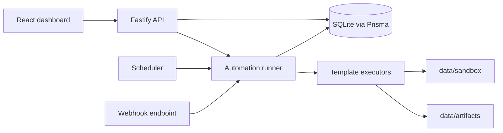

# FlowPilot Architecture

## System Shape

FlowPilot is a pnpm monorepo with three main packages:

- `apps/web`: React dashboard for operators.
- `apps/api`: Fastify API, Prisma persistence, scheduler, and workflow execution.
- `packages/shared`: Zod schemas, template definitions, and shared TypeScript types.

The shared package is the contract between UI and API. Template defaults, trigger types, run statuses, and config validators live there so workflow creation and execution stay aligned.
The automation builder also reads shared template field metadata, so the UI renders fields from the same package that defines backend validation.
Observability endpoints expose dashboard health summaries and filtered run/artifact queries without requiring the UI to duplicate database logic.

## Data Flow

1. A user creates an automation from a template.
2. The UI renders template-specific fields and asks the API to validate the config.
3. The API validates the template config with Zod and persists it in SQLite.
4. A trigger starts a run: manual button, scheduler tick, or webhook request.
5. The runner creates a `Run`, writes structured `RunLog` records, executes the matching template, retries when configured, and stores artifacts.
6. The UI reads runs, logs, and artifacts through API endpoints.

## Persistence

Core models:

- `Automation`: saved workflow definition, template key, trigger, config, and retry settings.
- `Run`: one execution attempt group with status, duration, output, and error.
- `RunLog`: ordered execution log entries.
- `Artifact`: Markdown output generated by templates.

## Observability

The dashboard summarizes success rate, average duration, last run time, status mix, and trigger mix. Runs can be filtered by status, trigger, automation, or search text. Artifacts can be filtered by type, automation, or search text. Run details render a timeline from the persisted `RunLog` and `Artifact` records.

## Safety Boundaries

FlowPilot does not execute arbitrary user code in v1. File paths are resolved through `resolveSandboxPath`, which rejects absolute paths and path traversal. Artifact writes are constrained to `data/artifacts`, and the file organizer defaults to dry-run mode.

## Scheduler

The scheduler is intentionally simple: an in-process interval scans enabled scheduled automations and starts runs when the configured interval has elapsed. This keeps local setup friction low while leaving a clear upgrade path to queues or cron expressions.

## Testing Strategy

- Unit tests cover retry behavior and sandbox path protection.
- API tests create automations, validate template configs, run templates, verify logs, and exercise webhooks.
- Frontend smoke tests render the main dashboard, automations page, guided builder, run history, and artifact catalog with mocked API responses.
